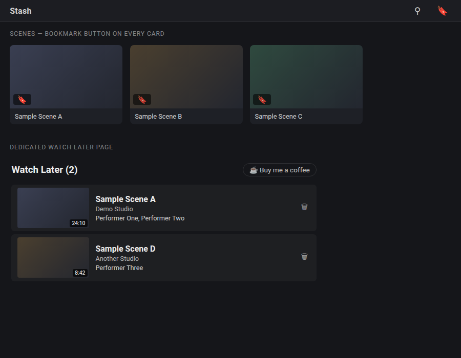

# Watch Later for Stash

A small [Stash](https://github.com/stashapp/stash) plugin that adds a **Watch Later** queue.

- A bookmark button appears on every scene card — click it to add/remove the scene from your queue.
- A dedicated **Watch Later** page (linked from the top nav bar) lists everything you've queued, most recently added first.
- Works by tagging scenes with a `Watch Later` tag (created automatically on first use) — no separate database, no extra state to keep in sync. Remove the tag from a scene anywhere in Stash and it drops out of the queue too.

*Illustrative mockup with placeholder data — not a screenshot of a real library.*

## Install

1. In Stash, go to **Settings → Plugins → Add Source**.
2. Add this index as a source:
   `https://spesometro2026.github.io/stash-watchlater-plugin/index.yml`
3. Find **Watch Later** in the list and install it.

Or manually: copy `watchlater.yml`, `watchlater.js` and `watchlater.css` into your Stash `plugins/watchlater/` folder and reload plugins.

## Notes

- Pure client-side UI plugin — no Python, no server-side hooks, nothing to configure.
- The "Watch Later" tag is a normal Stash tag: you can browse, filter or sort by it like any other tag outside the plugin too.

## Support

If this is useful to you: [☕ ko-fi.com/greenthumb80](https://ko-fi.com/greenthumb80)

## License

MIT
